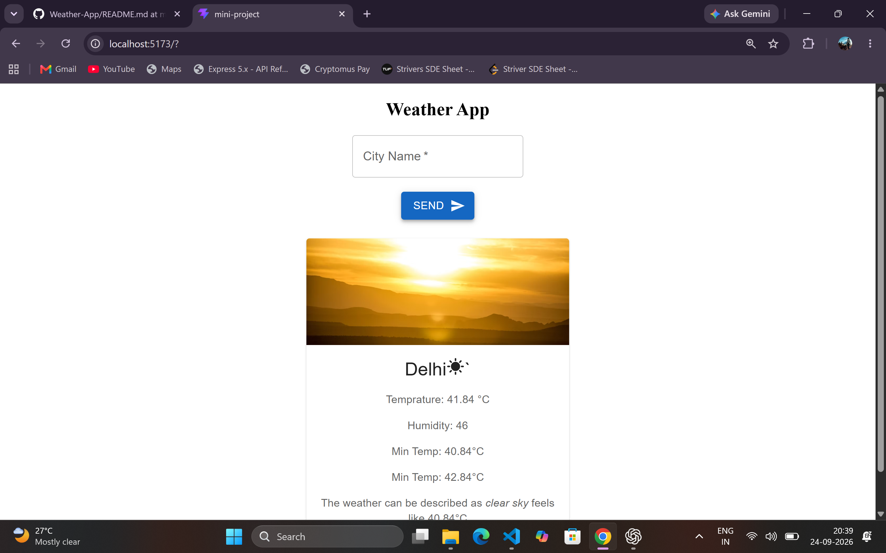
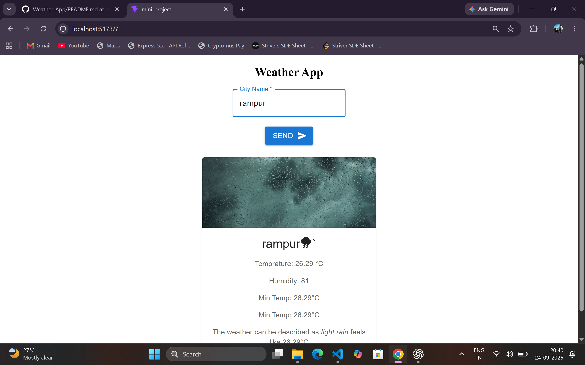
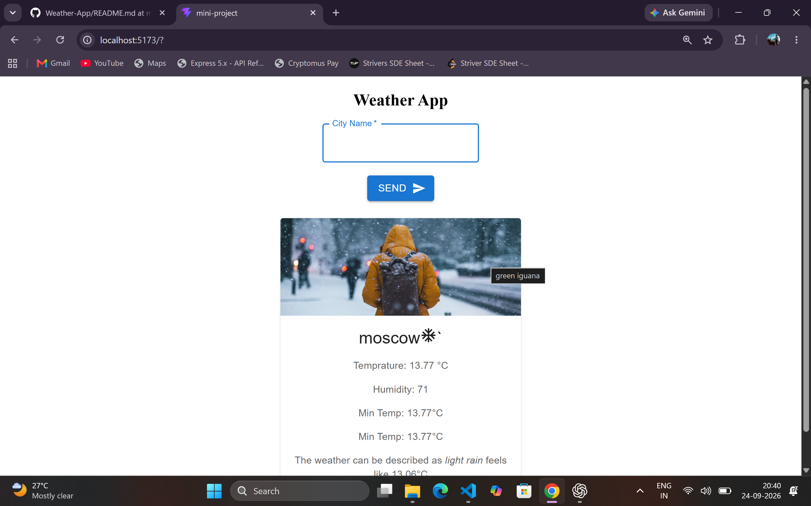

# Weather App 🌤️

A simple weather application built with **React** that displays weather information for a city.

## Features

* Search weather by city name
* Displays weather information for the searched city
* Fetches weather data from the **OpenWeatherMap API**
* Simple and responsive user interface

## Technologies Used

* React
* JavaScript
* CSS
* Vite
* OpenWeatherMap API

## Screenshots

## API

Weather data is provided by **OpenWeatherMap**.

[OpenWeatherMap](https://openweathermap.org/)

## Author

**Lakshya Saxena**
